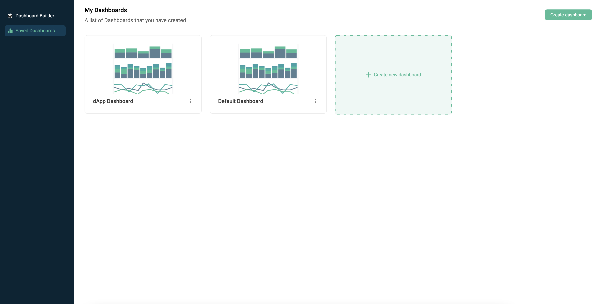
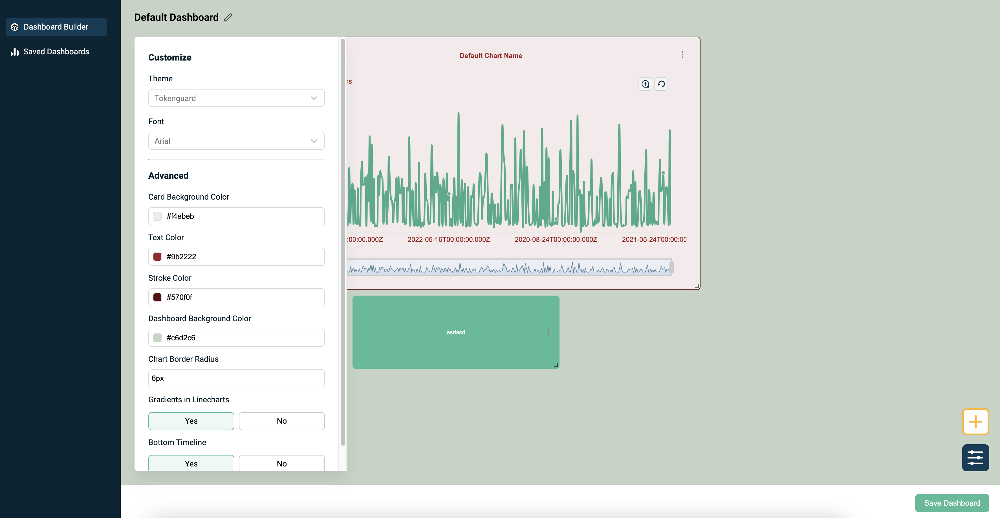

# Integration Testing Guide

## Introduction

This guide covers how to set up and run integration tests for the project. Integration tests ensure that different parts of the application work together as expected. This respository is part of a bigger system consisting of 3 components + corresponding databases.

1. [dashboard-creator-server](https://github.com/tokenguardio/dashboard-creator-server/tree/v2.0.6) - the backend service storing information about build dashboards and queries
2. [dashboard-creator-client](https://github.com/tokenguardio/dashboard-creator-client/tree/v2.0.3) - frontend app
3. [db-api](https://hub.docker.com/r/patternsjrojek/db-api) - REST interface between PostgreSQL database and backend service. [Tokenguard.io](https://tokenguard.io) has its private implementation of such service and its image is available in dockerhub, however everyone is encouraged to create his own db-api and connect it to provided dashboard builder backend and frontend. The requirements for db-api interface schema are provided in [db-api.swagger.json](db-api.swagger.json) file.

To fully function backend service needs mongodb to store dashboard configuration, layout and displayed dashboard elements. Implementation of [Tokenguard.io](https://tokenguard.io) db-api consists of two PostgreSQL databases. One for storing queries (QUERIES*DB*_ env variables) and the other one with actual data for metrics visualization (DATA*DB*_ env variables)

## Prerequisites

Before you begin, make sure you have the following installed on your system:

- [Docker](https://www.docker.com/get-started)
- [Docker Compose](https://docs.docker.com/compose/install/)
- [Node.js](https://nodejs.org/) and [npm](https://www.npmjs.com/get-npm) or [Yarn](https://yarnpkg.com/)

## Setting Up the Environment

1. **create empty dir**: `mkdir dashboard-creator`
2. **move to new dir**: `cd dashboard-creator`
3. **clone frontend repository**: `git clone https://github.com/tokenguardio/dashboard-creator-client.git`
4. **go to repo root directory**: `cd dashboard-creator-client`
5. **switch to latest creator release**: `git checkout tags/v2.0.3 -b branch-v2.0.3`
6. **move back to project root dir**: `cd ..`
7. **clone backend repository**: `git clone https://github.com/tokenguardio/dashboard-creator-server.git`
8. **go to repo root directory**: `cd dashboard-creator-server`
9. **switch to latest creator release**: `git checkout tags/v2.0.6 -b branch-v2.0.6`
10. **move back to project root dir**: `cd ..`
11. **copy docker-compose file to project root dir**: `cp dashboard-creator-server/TESTING/docker-compose.yml .`
12. **build and run docker-compose**: `docker-compose up`

```
mkdir dashboard-creator
cd dashboard-creator
git clone https://github.com/tokenguardio/dashboard-creator-client.git
cd dashboard-creator-client
git checkout tags/v2.0.3 -b branch-v2.0.3
cd ..
git clone https://github.com/tokenguardio/dashboard-creator-server.git
cd dashboard-creator-server
git checkout tags/v2.0.6 -b branch-v2.0.6
cd ..
cp dashboard-creator-server/TESTING/docker-compose.yml .
docker-compose up
```

### Testing backend service

Go to [http://localhost:8081/api-docs](http://localhost:8081/api-docs) to review available endpoints to read database schema, table structure and construct metrics queries  


### Seeing it all in action

Go to [http://localhost:5173](http://localhost:5173) and create your first dashboard metrics!  


1. select `Dashboard builder` from the sidepanel and then choose `Visualization`  
   
2. Choose one of available data sources and table, and then decide which dimension you want to see on X axis and which metric(s) you want to see on Y axis.  
     
   NOTE: If you select two dimentsions on X axis, the results will be grouped by the second dimension resulting in multiline/multibar chart.  
   
3. You can adjust name of the metric to your needs in top left corner. When you are happy with your results, click `Save` button in top-right corner
4. After a few visualizations are added, you can freely adjust layout of your dashboard for maximum readability by drag-drop metrics or changing their size by pulling metrics at their bottom-right corner.

  
5. You can also adjust look-and-feel of your dashboard  

